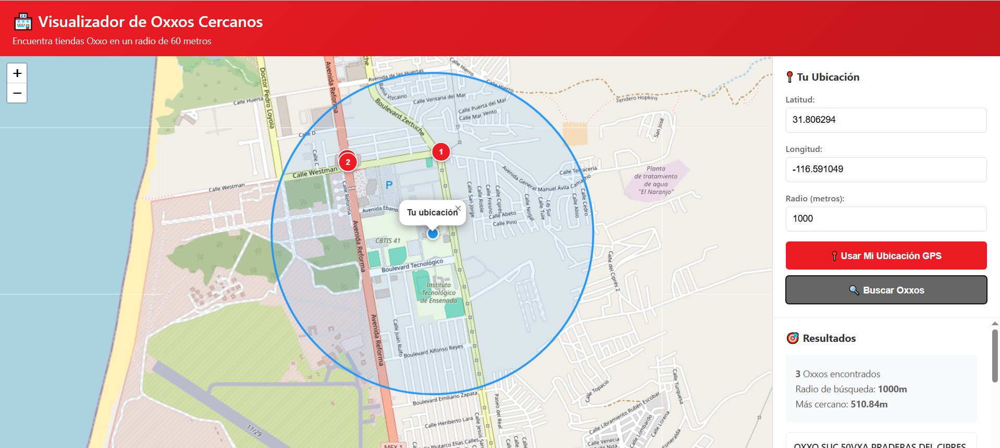

# 🏪 Visualizador de Oxxos Cercanos

**Author(s):** Daiji Kato

**Status:** Review

**Última actualización:** 10/12/2025

## Contenido
- [Objetivo](#objetivo)
- [Goals](#goals)
- [Non-Goals](#non-goals)
- [Background](#background)
- [Overview](#overview)
- [Requisitos](#-requisitos)
- [Uso](#-uso)
- [Estructura del Proyecto](#-estructura-del-proyecto)
- [Funcionalidades](#-funcionalidades)
- [Endpoints](#-endpoints)
- [Imágenes](#-imágenes)
- [Notas](#-notas)

---

## Objetivo

Crear una aplicación web que permita visualizar desde ubicación real los Oxxos cercanos en un radio específico, facilitando a turistas y residentes la localización rápida de tiendas de conveniencia cercanas para satisfacer necesidades inmediatas de forma segura.

## Goals

- **Visualizar los puntos (Oxxos) en el mapa**: Mostrar la ubicación exacta de todas las tiendas Oxxo en un mapa interactivo con marcadores numerados.
- **Ubicar el punto de ubicación en tiempo real**: Obtener automáticamente la posición GPS del usuario para centrar el mapa y la búsqueda.
- **Modificar el radio de búsqueda**: Permitir al usuario ajustar la distancia de búsqueda según sus necesidades (desde 10 hasta 5000 metros).

## Non-Goals

- No se busca evaluar la calidad del servicio, precios o disponibilidad de productos en las tiendas Oxxo.
- No se incluirá información en tiempo real sobre horarios de apertura, inventario o promociones activas.
- No se proporcionarán rutas de navegación paso a paso o direcciones de conducción entre ubicaciones.
- No se realizará seguimiento de usuarios, almacenamiento de historial de búsquedas o recolección de datos personales.
- No se incluirá información sobre otros establecimientos comerciales o servicios diferentes a Oxxo.
- No se implementará sistema de reseñas, calificaciones o comentarios de usuarios sobre las tiendas.
- No se proporcionará información sobre disponibilidad de estacionamiento, accesibilidad o servicios adicionales de cada tienda.

## Background

En ciudades grandes como Tijuana, tanto turistas como residentes ocasionales enfrentan dificultades para ubicarse y encontrar servicios básicos de manera rápida y segura. Las tiendas Oxxo, siendo una de las cadenas de conveniencia más extendidas en México, representan puntos de referencia confiables donde se pueden adquirir productos esenciales, realizar pagos de servicios o simplemente orientarse en la ciudad.

Sin embargo, caminar largas distancias en búsqueda de estos establecimientos, especialmente en zonas desconocidas o durante horarios nocturnos, puede representar un riesgo de seguridad. Además, no contar con información precisa sobre la ubicación de tiendas cercanas puede generar pérdida de tiempo y exposición innecesaria en áreas potencialmente inseguras.

Esta aplicación surge como respuesta a la necesidad de transformar estos datos estáticos en una herramienta práctica y accesible que permita a cualquier persona localizar rápidamente las opciones más cercanas desde su ubicación actual, priorizando su seguridad y comodidad.

## Overview

La aplicación **Visualizador de Oxxos Cercanos** es una plataforma web interactiva que integra tecnologías de geolocalización, bases de datos y mapas dinámicos para proporcionar información inmediata sobre tiendas Oxxo cercanas al usuario.

El sistema utiliza **SQLite** para almacenar de manera estructurada los datos del DENUE (1,312 ubicaciones de Oxxo), calculando distancias precisas mediante la **fórmula de Haversine**. A través de una interfaz moderna desarrollada con **Flask** y **Leaflet Maps**, los usuarios pueden:

1. Obtener su ubicación GPS automáticamente o ingresarla manualmente
2. Ajustar el radio de búsqueda según sus necesidades (60 metros por defecto)
3. Visualizar en tiempo real todas las tiendas Oxxo dentro del radio especificado
4. Ver resultados ordenados por distancia con información detallada
5. Interactuar con un mapa que muestra marcadores numerados y permite seleccionar tiendas específicas

La aplicación está diseñada para ser rápida, intuitiva y accesible desde cualquier dispositivo con navegador web, proporcionando una solución práctica para planificar desplazamientos seguros y eficientes hacia tiendas de conveniencia cercanas.

---

## 📋 Requisitos

- Python 3.7 o superior
- Flask 3.0.0

## ▶️ Uso

1. Ejecuta la aplicación:
```bash
python app.py
```

2. Abre tu navegador en: `http://localhost:5000`

3. Usa el sistema:
   - Haz clic en "📍 Usar Mi Ubicación GPS" para obtener tu ubicación actual o ingresa manualmente tu latitud y longitud.
   - Ajusta el radio de búsqueda (por defecto 60 metros).
   - Haz clic en "🔍 Buscar Oxxos".

## 🗂️ Estructura del Proyecto

```
backend/
├── app.py                      # Servidor Flask con API
├── templates/
│   └── index.html             # Interfaz del visualizador
├── oxxos.db                   # Base de datos SQLite (se crea automáticamente)
├── Oxxos_normalizado.csv      # Datos normalizados
└── requirements.txt           # Dependencias Python
```

## 🔧 Funcionalidades

- Base de datos SQLite con índice de Oxxos
- Cálculo de distancia
- Geolocalización GPS del navegador
- Mapa interactivo con Leaflet (estilo Google Maps)
- Búsqueda en radio personalizable (60m por defecto)
- Visualización de resultados ordenados por distancia
- Marcadores numerados en el mapa
- Interfaz responsiva y moderna

## 🌐 Endpoints

### GET `/api/oxxos-cercanos`
Busca Oxxos en un radio específico.

**Parámetros:**
- `lat`: Latitud (requerido)
- `lon`: Longitud (requerido)
- `radio`: Radio en metros (opcional, default: 60)

**Respuesta:**
```json
{
  "success": true,
  "total": 2,
  "oxxos": [
    {
      "id": 123,
      "nombre": "OXXO EJEMPLO",
      "latitud": 32.5149,
      "longitud": -117.0382,
      "distancia": 45.5
    }
  ]
}
```

### GET `/api/todos-oxxos`
Obtiene todos los Oxxos de la base de datos.

## 📝 Notas

- La base de datos se crea automáticamente la primera vez que ejecutas la aplicación
- Los datos se cargan desde `Oxxos_normalizado.csv`
- El mapa usa OpenStreetMap como proveedor de tiles
- La precisión del GPS depende del dispositivo y el navegador


## 📷 Imágenes

### Interfaz Principal

